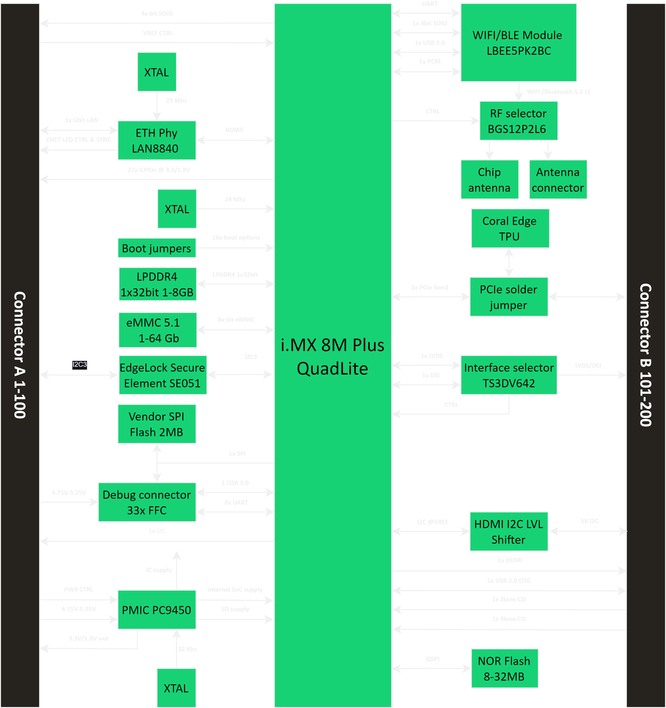

# Pi.MX8 SoM

The Pi.MX8 is a SoM (System-on-Module) based on NXP's i.MX 8M plus SoC.
The Pi.MX8 module contains the core SoC complex consisting of an LPDDR4 memory device and a power management IC (PMIC) block. In addition, an eMMC device and a WiFi/BLE module provide additional mass storage and connectivity.
By integrating the core SoC complex, a SoM greatly simplifies system design by allowing separation of the high-complexity, high-density computing system from the typically lower-density peripherals. The Pi.MX8 allows a tested and proven Linux building block to be easily integrated into custom electronic devices.
The Pi.MX8 interfaces with the host system through two 0.4mm pitch board-to-board connectors. All interfaces from multi-media to real-time controllable GPIOs required for designing modern embedded systems are broken out through these connectors.

## Pi.MX8 block diagram

# Pi.MX8 Full stack - Coming Soon

## Pi.MX8 IO Stack

The SoM is coming soon with a full stack, which provides easy access to various interfaces like HDMI, Ethernet, USB, m.2 and many more. An Enclosure integrates the whole stackup into a small formfactor.

# Pi.MX8 Full stack

## License

This project uses different licenses for different components:

- Electronics: CERN-OHL-S-2.0
- Firmware: Upcoming in the future
- Mechanical: Upcoming in the future
See the respective folders for full license texts.
